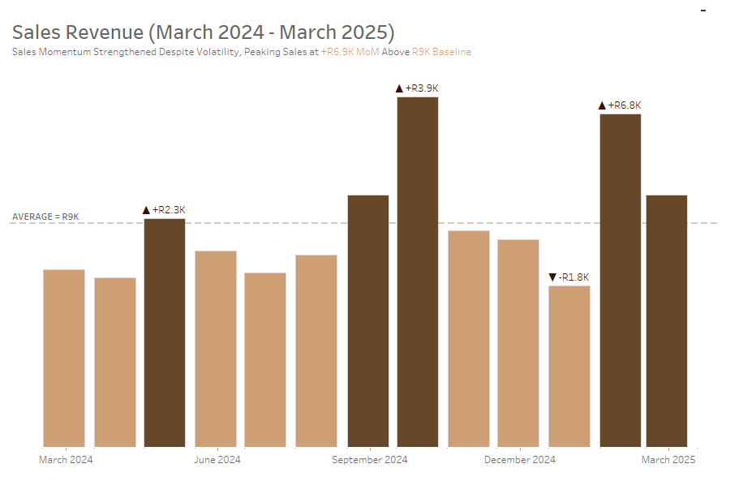
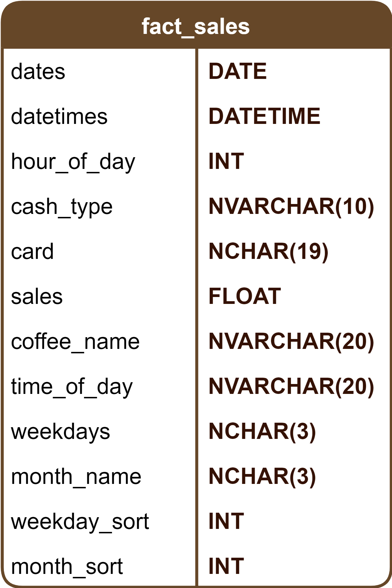
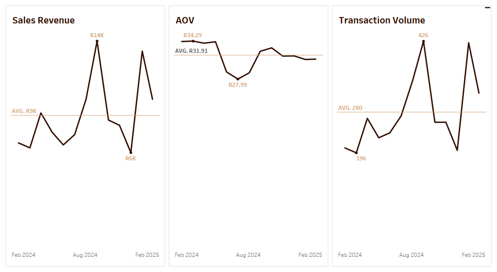
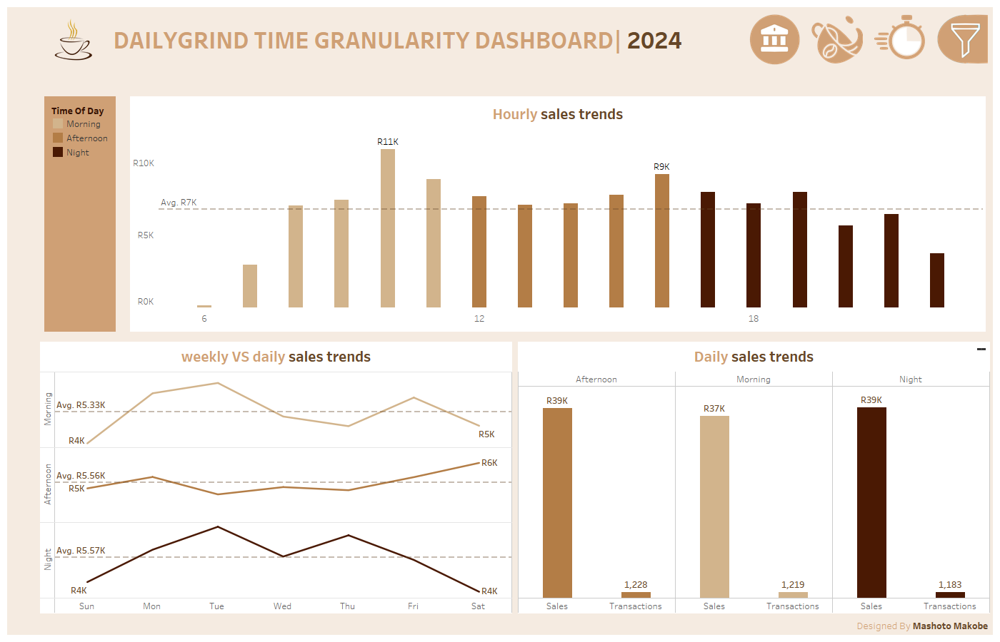
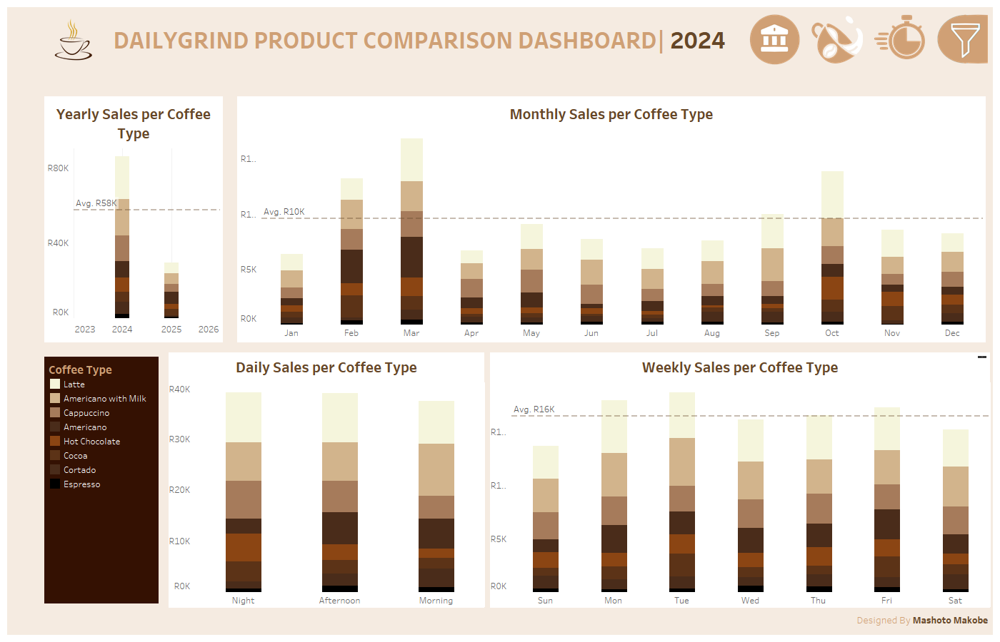

  

<h1 align = "center"><strong>DailyGrind Performance Report</strong></h1>
<h2 id="top"> Table of Contents</h2>

- [Project Background](#project-background)
- [Executive Summary](#executive-summary)
- [Insights Deep-Dive](#insights-deep-dive)
  - [Sales Trend](#sales-trend)
  - [Time Granularity Performance](#time-granularity-performance)
  - [Key Product Performance](#key-product-performance)
- [Recommendations](#recommendations)
- [Clarifying Questions, Assumptions, and Caveats](#clarifying-questions-assumptions-and-caveats)
  - [Questions for Stakeholders Prior to Project Advancement](#questions-for-stakeholders-prior-to-project-advancement)
  - [Assumptions and Caveats](#assumptions-and-caveats)
- [Tools and Technology Used](#tools-and-technology-used)
- [Next Steps](#next-steps)
- [Author](#author)  

## Project Background

<table align="center">
  <tr>
    <td width="1440">
      <body>
        DailyGrind is a boutique coffee shop based in <strong>Cape Town, South Africa</strong>, recognised for its artisanal coffee offerings and personalised in-store experience. Serving a broad mix of professionals, students, and everyday coffee consumers, the business focuses on consistency, quality, and convenience through high-frequency, low-basket transactions.
        Founded in <strong>2024</strong>, DailyGrind has steadily expanded its operations while facing increasing competition from comparable cafés and changing consumer demand patterns. As transaction volume has grown, the business has placed greater emphasis on using point-of-sale (POS) data to support operational efficiency, product optimisation, and evidence-based decision-making.      
        The available dataset covers <strong>March 2024 to March 2025</strong> and consists of <strong>3,636 completed transactions</strong>, generating over <strong>R115,000 in sales revenue</strong>. The data captures transaction-level information across sales values, product types, and multiple time granularities (daily, hourly, and monthly). There is no customer-level identification, and each transaction represents <strong>a single completed customer order</strong>.
        Reporting to the <strong>Head of Operations</strong>, this analysis evaluates <strong>sales trends, temporal performance, and product behavior</strong> to uncover actionable insights related to peak trading periods, product mix dynamics, and operational alignment. The findings are intended to support staffing optimisation, menu planning, and revenue stability rather than customer-level behavioural analysis. The key insights and recommendations focus on the following areas:
      </body>
      </body>
      <h3>Northstar Metrics</h3>
        <ul><li><Strong> Sales performance</strong> - Sales revenue, volume of transaction placed, and average order value (AOV).</li>
        <li><strong> Time-based performance</strong> - Daily, weekly, and monthly trading patterns</li>
        <li><strong> Product performance</strong> - Revenue contribution and product mix dynamics across the menu</li>
        </ul>
    </td>
  </tr>
</table>

## Executive Summary 

<table align="center">
  <tr>
    

      <h3 align="center">Sales Revenue Analysis (2024 - 2025)</h3>
      

        
      

      <td width="460" valign="top">
        <ol>
          <li>
            <strong>Revenue Growth and Peak Performance:</strong>
            <ul>
              <li>DailyGrind experienced sustained revenue growth from July to October 2024, with October 2024 emerging as the strongest trading month, materially exceeding the R9K average monthly revenue benchmark.</li>
              <li>The period recorded multiple positive MoM gains, including a +R3.9K increase, indicating strong customer demand, effective product mix, and consistent transaction volume during peak café trading months.</li>
            </ul>
          </li>
          <li>
            <strong>Short-Term Slowdown & Demand Softening</strong>
            <ul>
              <li>January 2025 recorded the weakest performance, with a MoM decline of -R1.8K, reflecting a post-peak seasonal common in coffee retail following the festive period.</li>
              <li>This contraction suggests lower foot traffic and reduced transaction frequency, rather than structural revenue decline.</li>
            </ul>
          </li>
        </ol>
      </td>
      <td width="460" valign="top">
        <ol start="3">
          <li>
            <strong> Strong Recovery & Sales Momentum </strong>
            <ul>
              <li>February 2025 delivered the strongest recovery, posting the highest MoM growth (+25%) and a +R6.8K revenue increase, signaling a rapid return of customer demand.</li>
              <li>March 2025 sustained revenue above the historical average, confirming stabilization and improved sales momentum rather than a temporary spike.</li>
            </ul>
          </li>
          <li>
            <strong>Key Takeaways & Recommendations</strong>
            <ul>
              <li>Investigate the causes of the     steep drop and continuing decline (e.g., market changes, competition, internal factors) from  November 2024 to January 2025.</li>
              <li>Replicate Q3–Q4 trading strategies (pricing, promotions, product bundles) to maximize revenue during high-demand periods.</li>
              <li>Capitalize on high-demand periods high-traffic months by aligning staffing levels, operating hours, and inventory planning with historically strong sales months to prevent stockouts and service bottlenecks.</li>
              <li> early-year revenue softness through tactical pricing, limited-time menu offerings, and seasonal drink promotions to increase Transactions and AOV during slower trading months.</li>
              <li>Use monthly Sales, Transactions, and AOV as North Star Metrics to guide decisions on product mix, pricing adjustments, and peak-hour scheduling. Monitor MoM revenue shifts to proactively respond to demand changes, enabling faster operational adjustments rather than reactive decision-making.</li>
            </ul>
          </li>
        </ol>
      </td>
    

  </tr>
</table>
<h2 align="center">Dataset Structure and ERD (Entity relationship diagram)</h2>
<body>The database structure as seen below consists of merely <strong>one table: fact_sales</strong>, with a total row count of 3636 records.</body>

  

  

## Insights Deep-Dive
### Sales Trend

<table align="center">
  <tr>
    <td width="1000">
      
    </td>
  </tr>
</table>
<table align = "center">
  <tr>
    <td width = "333" valign = "top">
      <strong>Sales Revenue</strong>
      <ol>
        <li>Mid-Year Revenue Acceleration with a Clear Peak <ul>
            <li>DailyGrind’s sales revenue shows a steady <strong>upward trajectory</strong> from early 2024, culminating in a <strong>pronounced peak</strong> around <strong>August 2024</strong>, where monthly revenue reached approximately R14K, materially above the <strong>R9K monthly average</strong>.</li>
            <li>This period likely reflects increased foot traffic during mid-year trading months, supported by stable demand for core coffee offerings.</li>
          </ul>
        </li>
        <li>Late-Year Softening and Short-Term Dip <ul>
            <li >Following the August peak, revenue declined sharply toward the end of 2024, reaching a low of approximately <strong>R6K</strong>, indicating a short-term contraction in trading performance.</li>
            <li>This dip is more indicative of reduced transaction volume rather than pricing pressure, suggesting seasonal or operational factors rather than structural demand loss.</li>
          </ul>
        </li>
        <li>Early 2025 Recovery Signals<ul>
            <li>Revenue rebounds strongly in early 2025, returning to levels above the historical average.</li>
            <li>This recovery suggests resilient baseline demand and confirms that the late-2024 decline was temporary rather than indicative of sustained underperformance.</li>
          </ul>
        </li>
      </ol>
    </td>
    <td width = "333" valign = "top" >
      <strong> Average Order Value </strong>
      <ol>
        <li> Stable AOV with Limited Volatility<ul>
            <li>
              <strong>AOV remains relatively stable</strong> throughout the reporting period, <strong>averaging R31.91</strong>, with a narrow range between approximately <strong>R28 and </strong>.
            </li>
            <li>This stability aligns with the dataset structure, where <strong>each transaction represents a single customer order</strong>, resulting in limited variability in order value.</li>
            <li>AOV experienced a temporary dip around mid-2024, reaching a low of R27.99, before recovering and stabilising closer to the long-term average. This fluctuation likely reflects shifts in product mix (e.g. higher share of standard coffees versus premium drinks) rather than pricing changes.</li>
          </ul>
        </li>
        <li> Mid-Year Dip and Normalization <ul>
            <li> AOV experienced a temporary dip around mid-2024, reaching a low of <strong>R27.99</strong>, before recovering and stabilising closer to the long-term average.</li>  
            <li>This fluctuation likely reflects shifts in product mix (e.g. higher share of standard coffees versus premium drinks) rather than pricing changes.</li>
          </ul>
        </li>
        <li>Interpretation of AOV Trends <ul>
            <li> Given the one-transaction-per-order structure, AOV should be interpreted as an indicator of menu pricing and item selection, not increased customer spend per visit.</li>  
            <li>Changes in AOV primarily reflect the balance between premium and standard beverage purchases over time.</li>
          </ul>
        </li>
      </ol>
    </td>
    <td width = "333" valign = "top">
      <strong> Transaction Volume </strong>
      <ol>
        <li> Transaction Volume as the Primary Revenue Driver<ul>
            <li>
              Transaction counts closely mirror revenue trends, confirming that <strong>changes in total sales are driven mainly by order volume rather than AOV</strong>.
            </li>
            <li>The strongest transaction spike occurs around <strong>August 2024</strong>, peaking at approximately <strong>426 transactions</strong>, well above the <strong>average of 280</strong>.</li>
          </ul>
        </li>
        <li>Late-Year Decline in Orders<ul>
            <li> Transaction volume declines significantly toward the end of 2024, reaching a low of approximately <strong>196 transactions</strong>, which directly explains the observed revenue dip during the same period.</li>
            <li> This suggests lower foot traffic or reduced visit frequency rather than changes in customer spend per order.</li>
          </ul>
        </li>
         <li>Rebound in Early 2025<ul>
            <li> A sharp recovery in transaction volume is observed in early 2025, driving the parallel rebound in sales revenue.</li>
            <li> This reinforces the conclusion that DailyGrind’s performance is volume-led, with consistent pricing and stable order values.</li>
          </ul>
        </li>
      </ol>
    </td>
  </tr>
</table>

## Time Granularity Performance

<table align="center">
  <tr>
      

        <h3>Midday Trading Hours Drive Sales, While Evening Demand Softens</h3>
        
      

    <tr>
  </tr>
</table>
<table align="center">
  <tr>
      <td width="333" valign="top">
      <h3>Hourly Sales Dynamics</h3>
      <body>Hourly sales patterns reveal a classic <strong>commuter-driven café demand curve</strong>, with revenue accelerating sharply from early morning and peaking during mid-morning to early afternoon.</body>
      <ul>
        <li><strong>Peak trading hours occur between 08:00 and 11:00</strong>, with the strongest single-hour performance reaching approximately <strong>R11K</strong>, materially above the hourly average of <strong>~R7K</strong>.</li>
        <li>This window likely reflects <strong>pre-work coffee runs, mid-morning breaks, and takeaway demand</strong>, making it the most operationally critical period of the day.</li>
        <li>Post-midday hours (12:00–15:00) remain relatively stable but slightly below peak, indicating sustained demand rather than a sharp drop-off.</li>
        <li><strong>Evening and night trading hours show a gradual decline</strong>, with late-night hours falling well below the daily average. This suggests reduced foot traffic and more discretionary purchases rather than routine consumption.</li>
      </ul>
      <body><strong>Operational implication</strong>: Revenue is highly sensitive to execution during the morning rush. Small disruptions (understaffing, slower service, stockouts) during this window likely have an outsized impact on daily sales performance.</body>
      </td>
  <td width="333" valign="top">
      <h3>Daily vs Weekly Sales Behaviour</h3>
      <body>When viewed across the week, sales patterns demonstrate <strong>predictable weekday stability with mild volatility</strong>, rather than extreme spikes or collapses.</body>
      <h4>Morning Performance</h4>
      <ul>
        <li>Morning sales average <strong>~R5.33K per day</strong>, with noticeable strength early in the week.</li>
        <li>Demand softens slightly toward mid-week before recovering on Fridays, suggesting routine weekday commuting behaviour.</li>
        <li>Expresso has a relatively low price point (R21.00). Its stable but do not significantly impact AOV.</li>
        <li>Weekend mornings underperform relative to weekdays, indicating fewer early starts and a shift in customer routines.</li>
      </ul>
      <h4>Afternoon Performance</h4>
      <ul>
        <li>Afternoon sales are the most stable time segment, averaging <strong>~R5.56K</strong>.</li>
        <li>Minor mid-week dips are followed by a gradual build-up toward the end of the week.</li>
        <li>This consistency suggests afternoon traffic is driven by <strong>habitual repeat visits</strong>, such as lunch breaks or study/work sessions.</li>
        <li>Weekend mornings underperform relative to weekdays, indicating fewer early starts and a shift in customer routines.</li>
      </ul>
      <h4>Afternoon Performance</h4>
      <ul>
        <li>Night sales average <strong>~R5.57K</strong>, but exhibit <strong>higher volatility</strong> than other periods.</li>
        <li>Mid-week nights outperform weekends, likely reflecting weekday social or post-work consumption.</li>
        <li>Weekend nights show a pronounced decline, implying reduced relevance of late trading hours for DailyGrind’s core customer base.</li>
      <body><strong>Operational implication</strong>: Afternoon demand provides revenue stability, while night trading carries higher variability and risk. Staffing and operating hours should reflect this asymmetry.</body>
      </ul>
      </td>
      <td width="333" valign="top">
      <h3>Time of Day Contribution to Revenue and Transactions</h3>
      <body>Despite similar total revenue contributions across time-of-day segments, transaction behavior reveals important nuances.</body>
      <ul>
        <li><strong>Afternoon generates the highest total sales (R39K)</strong> and the highest transaction count <strong>(1,228 transactions)</strong>, confirming it as the <strong>volume anchor</strong> of the business.</li>
        <li><strong>Morning sales (R37K)</strong> occur across slightly fewer transactions <strong>(1,219)</strong>, <strong>implying marginally higher per-transaction value</strong> driven by premium coffee choices or add-ons.</li>
        <li><strong>Night sales (R39K)</strong> match afternoon revenue but are supported by the lowest transaction count (1,183), indicating higher variability and potentially longer dwell times or bundled purchases.</li>
      </ul>
      <body><strongp>Operational implication</strongp>:
        <li>Afternoon periods are critical for throughput and service efficiency.</li>
        <li>Morning periods are critical for speed and consistency.</li>
        <li>Night periods should be evaluated for cost-effectiveness rather than pure revenue contribution.</li></body>
      </td>
</tr>
</table>
<h3>Strategic Interpretation of Time-Based Demand</h3>
<body>
 <li>DailyGrind’s performance is front-loaded, with a disproportionate share of value created before midday.</li>
 <li>Weekly demand patterns are structurally predictable, making them well-suited for rule-based scheduling and inventory planning.</li>
 <li>Revenue softness during late hours suggests diminishing returns from extended operating hours without targeted interventions.</li>
</body>

## Key Product Performance

<table align="center">
  <tr>
      

        <h3>Latte Drives Core Sales Volume, While Specialty Coffee Types Capture Niche Segments</h3>
        
      

    <tr>
  </tr>
</table>
<table align="center"> 
  <tr>
      <td width="333" valign="top">
      <h3>The Best and Worst</h3>
      <ul>
        <li> Latte consistently outperformed all other menu items, generating approximately R27,000 in total sales and maintaining strong month-over-month performance.</li>
        <li> Americano with Milk (R25,000) and Cappuccino (R18,000) followed as the second and third highest revenue-generating products, indicating stable demand for core espresso-based drinks.</li>
        <li> In contrast, Espresso recorded significantly lower total sales (R3,000) despite its typical popularity in café environments.
        </li>
        <li> Cortado also underperformed relative to the rest of the menu, with total sales of R8,000, suggesting limited customer uptake or weaker positioning.</li>
      </ul>
      </td>
  <td width="333" valign="top">
      <h3>AOV Over Time</h3>
      <ul>
        <li> Average Order Value remained largely stable throughout the reporting period, reflecting the structural constraint that each transaction represents a single order.</li>
        <li> AOV measured R31.87 in early 2024, declining slightly to R31.40, with a peak of R34.30 in April and a low of R28.00 in August.</li>
        <li> Higher-priced beverages such as Hot Chocolate (R36.07), Cappuccino (R36.00), and Cocoa (R35.71) contributed disproportionately to AOV. Espresso, priced at R21.00, remained stable but had minimal influence on overall AOV trends.</li>
        <li> The gradual downward trend in AOV aligns more closely with declining product sales volume than with pricing changes.</li>
      </ul>
      </td>
      <td width="333" valign="top">
      <h3>Transaction Volume Over Time</h3>
      <ul>
        <li> The transaction Volume over time were volatile  and matched the sales revenue indicating that it was the main contributor to the sales revenue. THE TRANSACTION WERE THE HIGHEST IN TH THIESE MONTHS DUE TO SEASONALIT AND OTHER FACTORS S</li>
        <li>Biggest Q4 Performer: The 27-inch 4K Gaming Monitor and Apple AirPods saw the biggest spikes.</li>
        <li>Sales tend to dip in January and February after the holiday season in Q1.</li>
        <li>MacBook Air, ThinkPad, and the 27-inch 4K Gaming Monitor maintain consistent demand, as sales through Q2 and Q3 remain relatively stable but lower than in Q4.</li>
      </ul> 
      </td>
</tr>
</table>

## Recommendations

<table align="center"> 
  <tr>
      <td width="333" valign="top">
      <h3> Sales Revenue</h3>
      <ul>
        <li> Prioritize operational readiness (staffing, stock, prep capacity) during historically strong trading months and peak hours.</li>
        <li> Actively monitor month-over-month revenue changes and adjust operating intensity (hours, staffing, stock depth) rather than reacting to daily fluctuations.</li>
        <li> Focus revenue growth efforts on capturing existing demand efficiently, particularly during peak trading hours, before introducing additional promotions.</li>
      </ul>
      </td>
  <td width="333" valign="top">
      <h3>AOV </h3>
      <ul>
        <li> Maintain AOV stability by actively managing product mix, ensuring higher-priced drinks are consistently visible and available.</li>
        <li> Introduce or rotate premium beverages during slower periods to support revenue without increasing order complexity.</li>
        <li> Use sustained AOV changes as a trigger to review pricing or menu composition, not customer behavior.</li>
      </ul>
      </td>
      <td width="333" valign="top">
      <h3>Transaction Volume</h3>
      <ul>  
        <li>Increase transaction count by targeting low-traffic time windows with time-based initiatives that encourage incremental visits.</li>
        <li>Protect transaction throughput during peak hours by eliminating service bottlenecks, ensuring adequate staffing and prep capacity.</li>
        <li>Track transaction trends by hour and time of day to identify emerging demand shifts and adjust operations accordingly.</li>
      </ul>  
      </td>
</tr>
</table>
       
## Clarifying Questions, Assumptions, and Caveats

### Questions for Stakeholders Prior to Project Advancement

<table align="center">
  <tr>
      <td width="333" valign="top">
      <strong>Sales Value per Transaction (`sales`)</strong>
      <ul>
        <li>Does this value represent gross revenue per completed transaction?</li>
        <li>Are refunds, voids, or discounts ever applied outside this dataset?</li>  
        <li>Should future reporting reflect net sales instead of gross sales?</li>  
        <li>Does each sales value correspond to one complete order placed by a single customer?</li>
      </ul>
      </td>
  <td width="333" valign="top">
      <strong>Product Identification and Pricing (`coffee_name`)</strong>
      <ul>  
        <li>Are product names consistent and stable across the full reporting period?</li>  
        <li>Were there any price changes, recipe changes, or menu removals/additions during the timeframe?</li>
        <li>Does the same product name always correspond to the same price point?</li>
      </ul>
      </td>
      <td width="333" valign="top">
      <strong>Transaction Timing and Operating Hours (`datetimes`, `dates`, `hour_of_day`, `time_of_day`)</strong>
      <ul>
        <li>Does each timestamp correspond to one individual customer order event, rather than batch or end-of-day posting?</li>  
        <li>Do timestamps reflect the actual moment of customer purchase?</li>  
        <li>Do timestamps reflect the actual moment of customer purchase?</li>  
        <li>Were there any periods of offline POS usage or delayed transaction syncing?</li>
        <li>Are store operating hours consistent across all days represented?</li>
      </ul>
      </td>
</tr>
</table>

### Assumptions and Caveats

 > **Business Context**  
 > **DailyGrind** is a *fictional* boutique coffee shop used for analytical and portfolio demonstration purposes.
 > The dataset reflects realistic café-style transactional behavior.

#### Data Assumptions

|Category  | Assumption |
|---------|---------|
|**Business Context**| DailyGrind is a fictional boutique cafe; the dataset reflects realistic cafe transactions.|
|**Transaction Granularity**| Each row = one completed customer order; transactions are anonymous.|
|**Sales Value**| Represent gross revenue per transaction; refunds, voids, or discounts are negligible.|
|**Timestamps**| Reflect actual purchase time; operating hours assumed consistent; no delayed syncing.|
| **Product Data**|  Reflect actual purchase time; operating hours assumed consistent; no delayed syncing.|

#### Data Constraints

- No customer identifiers → cannot track repeat visits or lifetime value.
- Contextual drivers (promotions, marketing, intent) are not captured.
- Product add-ons/modifiers missing → higher-value orders may be underestimated.

#### Analysis Caveats

##### Revenue & AOV

- AOV reflects pricing and product mix, not customer spend intensity.
- Revenue changes driven by transaction count and item composition.

##### Time Granularity

- Daily trends are sensitive to operational/environmental factors (weather, staffing, load shedding, university recess).
- Weekly/monthly aggregation smooths volatility; dataset only covers one year.
- Peak periods indicate transaction concentration, not service efficiency.

##### Product Performance

- Revenue shifts can reflect mix changes more than demand volume.
- Assumes consistent product availability; stockouts/supplier issues not captured.
- Category comparisons should consider differences in frequency and price.

#### Analytical Scope

- Insights based solely on POS transactions.
- Supports operational decisions: staffing, product mix, peak-hour alignment.
- Customer behavior and promotional impact analysis are outside the dataset scope.

## Tools and Technology Used

- **[Datasets](datasets/):** Access to the project dataset (csv files).
- **[SQL Server Express](https://www.microsoft.com/en-us/sql-server/sql-server-downloads):** Lightweight server for hosting your SQL database.
- **[SQL Server Management Studio (SSMS)](https://learn.microsoft.com/en-us/sql/ssms/download-sql-server-management-studio-ssms?view=sql-server-ver16):** GUI for managing and interacting with databases.
- **[Git Repository](https://github.com/):** Set up a GitHub account and repository to manage, version, and collaborate on your code efficiently.
- **[Visual Studio Code](https://code.visualstudio.com/):** Write, debug and test SQL scripts and analytics code.
- **[DrawIO](https://www.drawio.com/):** Design data architecture, models, flows, and diagrams.
- **[Notion](https://www.notion.com/):** All-in-one tool for project management and organization.

## Next Steps

<ul>
 <li>Automate the analytics pipeline using Python to orchestrate scheduled data ingestion, data quality checks, feature engineering (e.g. time-based features, product groupings), and automated dashboard refreshes for consistent, reproducible reporting.</li>
 <li>Extend the analytical data model to support basket-level and modifier-level analysis, enabling deeper exploration of product mix, true basket value, price sensitivity, and time-based purchasing patterns.</li>
</ul>

***

***

- See my SQL queries for data exploration and advanced analysis in the **[Scripts Folder](scripts/)**.
- See the notebook for data cleaning, visualization, and analysis in the **[Python Notebook](docs/dailygrind_eda_and_visualisation.ipynb)**.
- For more of my projects and data journey, visit my **[github portfolio and reach out](https://github.com/mmashoto)**!

## Author

<!-- Back to Top Badge -->

  

