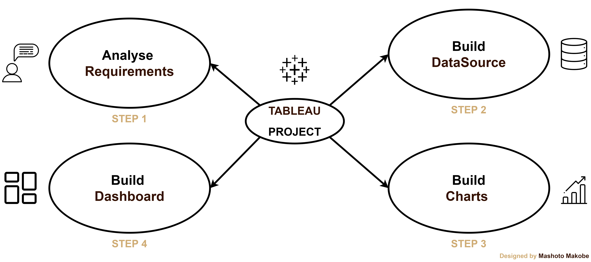
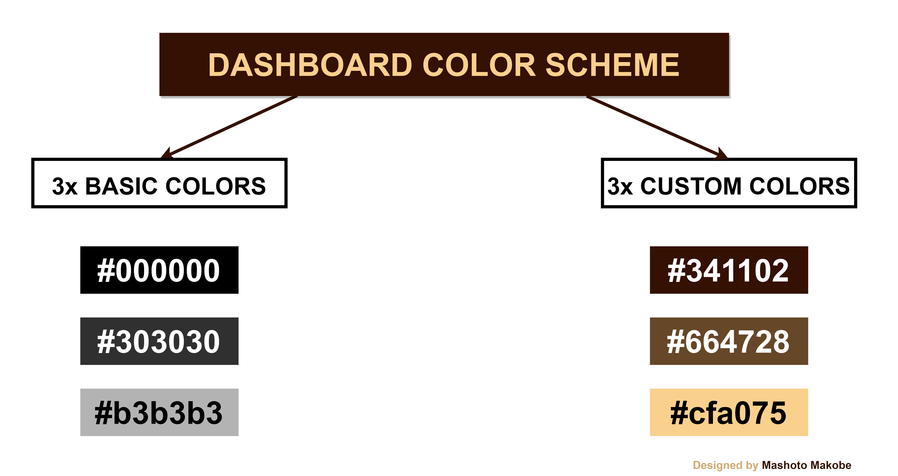

# Dashbaord Design Process

The dashbaord design process employs a rigorous and detailed-oriented methodology to create an intuitive and insightful interface, providing users with a seamless and informative experience. This structured approach is comprised of the following key phases:

### 1 Analyze Requirements

* Collect requirements
* Choose right charts
* Draw mockup
* Choose colors

### 2 Build Data Source

* Connect data
* Create  data model
* Rename fields of tables
* Check data type

### 3 Build Charts 

* Create calculated fields and test them
* Build charts
* Format

  * Remove lines & grids
  * Clean up axis
  * coloring
  * tooltips

### 4 Build Dashboard

* Draw mockup for containers
* Create container structure
* Put all the charts together
* Format

  * Distribute object evenly
  * Format colors, sizes, ect.
  * Fit "Entire View"
  * Add legends
  * Add spaces (inner and outer padding)
* Add filters for interactivity
* Add icons (logo and navigation between dashboards)

## Container Mockup
 
<table align="center">
  <tr>
    <td width="333">
      <h4>Container Mockup 1 : Sales <h4>
      
    </td>
    <td width="333">
      <h4>Container Mockup 1 : Product Comparison <h4>
      
    </td>
    <td width="333">
      <h4>Container Mockup 1 : Time Granularity <h4>
       
    </td>
  </tr>
</table>

The high-fidelity dashboard container mockup presents a comprehensive visualisation of the interface's structural framework. 
Key components include:

* Header
* Main dashboard area with strategic placements of:

  * Key Performance Indacators(KPIs)
  * Data visualisation and charts
  * Interactive filters and controls
* A supplementary sidebar feauring menu options
* ~~ A footer providing aucillary information ~~

These mockups provides a visual representation of the dashboard's structure, user interface, and key element placements, effectively demonstrating the flow and organization of data insights.

## Dashboard Color Scheme

The dashboard's color scheme is a modern and intuitive and delibarately designed to createa cohesive visual experience by harmoniously integrating the brand's logo colors. The palette combines basic and custom colors, carefully selected to enhance user experience, provide clarity, and maintain brand consistency. Basic colors are used for text and core topography , while the custom colors derived from the logo, are strategically applied to visuals and key design elements.